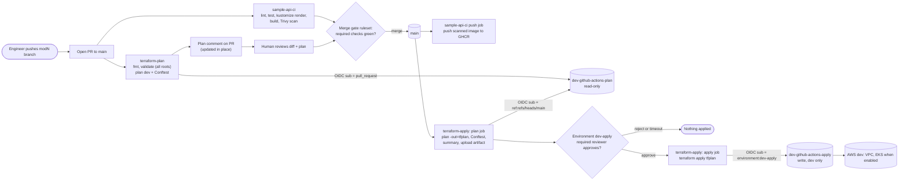
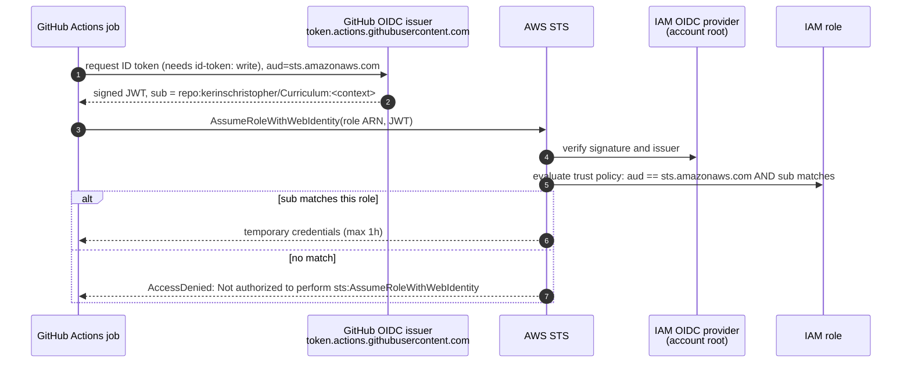
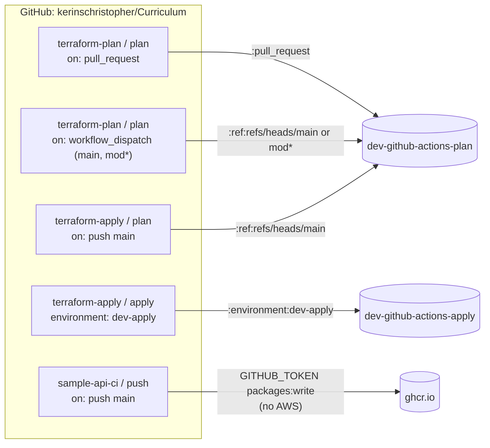

# Module 6: CI/CD with GitHub Actions, OIDC to AWS, Policy-as-Code and a Gated Terraform Apply
## Design Document

| Field | Value |
|---|---|
| **Author** | CK |
| **Date** | October 2026 |
| **Status** | Draft - Pending Approval |
| **Affected Repo** | `kerinschristopher/Curriculum` (public). New: `.github/workflows/sample-api-ci.yml`, `.github/workflows/terraform-apply.yml`, `Acme/infra/policies/`, `Acme/infra/terraform/ci-iam/` (re-homed), `Acme/infra/github/dev-apply-environment.json`, `docs/ci.md`. Changed: `.github/workflows/terraform-plan.yml`, `Acme/infra/terraform/modules/iam-roles/`, `Acme/infra/terraform/environments/dev/`, `Acme/apps/sample-api/`, `Acme/platform/apps/sample-api/` (APP_VERSION removal), `docs/iam.md`. Retired: `.github/workflows/sample-api-checks.yml`, `.github/workflows/terraform-checks.yml` (absorbed) |
| **Scope** | The single maintainer (`kerinschristopher`), who is both author and required reviewer; the AWS account `401352756330` in `us-east-1` (dev environment only, since stage/prod exist only as Kustomize overlays); consumers of `ghcr.io/kerinschristopher/sample-api` (the kind cluster today, Flux from Module 8) |

---

## Introduction / Purpose

This document designs the Module 6 deliverable from `docs/curriculum.md:284-331`:

- `sample-api-ci.yml`: lint, test, build the container, scan it with Trivy, and push to GHCR on `main`.
- `terraform-plan.yml`: `fmt`, `validate`, `plan` and a Conftest policy check on every PR, with the plan posted back to the PR as a comment.
- `terraform-apply.yml`: applies on merge to `main`, but only after a required reviewer approves through a GitHub Environment.
- No long-lived AWS keys anywhere. AWS access goes through GitHub OIDC.
- At least one Conftest policy ("no SSH open to the internet") evaluated against `terraform plan` JSON.
- `docs/ci.md` documents the IAM role each workflow assumes.

The design builds on what Module 3 and Module 5 already shipped: the hardened plan role, the trusted-branches ruleset, and the "trigger / trust / ruleset move together" rule in `docs/iam.md:107`. It also cleans up a partly applied earlier attempt at Module 6 that is still live in AWS (see Findings F3-F5).

---

## Backlog Story Number / Incident Number

**Curriculum Module 6** (no tracker ID was found in the repo).

Related items:
- PR #5 "Module 5" (`mod5` -> `main`) is **merged** (`ec5ad2f`). The merge took `mod5` at `2d42407`, so the branch's last commit, `c0356bc` ("fmt and validate every Terraform root in CI", which adds `terraform-checks.yml`), **was not on `main`**. It landed through PR #8 (`mod5` -> `main`, merged 2026-10-10).
- Earlier attempt: branch **`depmod6`** (renamed on GitHub from the original `mod6`; the current `mod6` is a fresh branch from `main`), commits `aaea69e`..`b1cfa3d`, forked from Module 5 commit `bdb5668`. Treat it as **prior art, not a base** (see F3).

---

## What Problem Are We Trying to Solve?

The pipeline is a contract: it defines what "this change is OK" means. Today the contract promises very little.

| Today, "green CI" means... | ...but it does not mean |
|---|---|
| Go code is `gofmt`-clean, vets and compiles (`sample-api-checks.yml`) | Tested (there are no `*_test.go` files), scanned for vulnerabilities, or published |
| Every Terraform root passes `fmt` and `validate` (`terraform-checks.yml`) | Planned. Plans only run when someone remembers to run `gh workflow run terraform-plan.yml` |
| Nothing | Checked against security policy. An SG open to `0.0.0.0/0:22` would pass every check |
| Nothing | Applied. Every apply is a human running `terraform apply` from WSL, with no recorded plan or approval |

Concrete problems:
1. **No PR feedback on infrastructure changes.** The reviewer of a Terraform PR can't see what it would do.
2. **Applies happen on a laptop.** There's no audit trail linking "this commit" to "this change in AWS", and no second look before it happens.
3. **The image is published by hand.** `ghcr.io/kerinschristopher/sample-api` has one tag, `0.1.1`, pushed manually, and the version is duplicated in three overlays plus the base (the `TODO(kerinschristopher)` in `Acme/platform/apps/sample-api/overlays/*/kustomization.yaml:20`).
4. **IAM ownership is split.** Two Terraform states each believe they own the plan role and the OIDC provider, and an unused apply role with `ReadOnlyAccess` sits in the account (F3-F5). The next person to apply the wrong root would silently undo the Module 3/5 hardening.

---

## Background

These are short primers on the concepts this design relies on. Skip the ones you already know.

**Workflows, jobs, steps, actions.** A *workflow* is a YAML file in `.github/workflows/`. It contains *jobs*. Each job runs on a fresh VM (a *runner*), and jobs run in parallel unless one `needs:` another. A job is a list of *steps*: shell commands (`run:`) or reusable packages of steps (*actions*, `uses:`). Jobs share nothing unless you pass it explicitly through *artifacts* (files uploaded by one job and downloaded by another) or *outputs*.

**Triggers and the `GITHUB_TOKEN`.** `on:` decides when a workflow runs: `pull_request`, `push`, `workflow_dispatch` (manual) or `schedule`. Every run gets a short-lived `GITHUB_TOKEN` scoped by the `permissions:` block. It expires when the job ends. GHCR accepts it for pushes (`packages: write`), so `sample-api-ci.yml` needs no stored credential at all.

**OIDC trust, in plain terms.** OpenID Connect (OIDC) lets one system vouch for an identity to another. Think of a venue wristband:
1. The job asks GitHub for a signed ID token (it needs `permissions: id-token: write`). The token says things like "I'm a job in repo `kerinschristopher/Curriculum`, running for the `dev-apply` environment". That statement is the **`sub` (subject) claim**.
2. The job hands the token to AWS STS (Security Token Service) and asks to become a specific IAM role (`AssumeRoleWithWebIdentity`).
3. AWS checks the signature against the account's registered GitHub OIDC provider, then checks the role's **trust policy**: is `aud` `sts.amazonaws.com`, and does `sub` match what this role allows?
4. If it matches, STS returns credentials that last at most an hour. Nothing long-lived is ever stored.

The `sub` claim is the lever. Its value depends on how the job runs:

| Job runs from | `sub` claim |
|---|---|
| `push` or `workflow_dispatch` on a branch | `repo:kerinschristopher/Curriculum:ref:refs/heads/<branch>` |
| `pull_request` | `repo:kerinschristopher/Curriculum:pull_request` |
| Any job with `environment: dev-apply` | `repo:kerinschristopher/Curriculum:environment:dev-apply` |

So "which role can a job get?" is decided by *how* the job was triggered and *whether it's bound to an environment*. That's why `docs/iam.md:107` says the trigger, the trust list and the ruleset have to move together.

**GitHub Environments and required reviewers.** An *environment* is a named deploy target in repo settings. It can require a reviewer's approval before any job that references it starts, and it can restrict which branches may deploy to it. A job with `environment: dev-apply` sits in "Waiting" until approved, and only then does it get an OIDC token whose `sub` names that environment. Combined with an IAM role that trusts *only* that `sub`, the approval click becomes a hard precondition for AWS write credentials, not just a UI nicety.

**Plan-as-artifact.** `terraform plan -out=tfplan` saves the exact set of changes to a file. `terraform apply tfplan` applies *that file*, no more and no less, and refuses if the state changed since the plan was made ("Saved plan is stale"). Saving the plan in one job and applying it in a later, approved job means **the reviewer approves exactly what gets applied.** Caveat: the plan file and its JSON form contain resource attribute values in plaintext, including values Terraform marks as sensitive.

**Conftest and Rego (policy-as-code).** `terraform validate` checks syntax. It can't tell you that a security group lets the whole internet reach port 22. Conftest is a small CLI that runs policies written in **Rego** (the language of Open Policy Agent) against structured data. Here the data is `terraform show -json tfplan`, a JSON document listing every resource change with its planned attribute values. A policy is a set of `deny` rules. If any rule produces a message, Conftest exits non-zero and the job fails. Policies get unit tests (`conftest verify`) with fake plan JSON, which proves a rule actually fires when it should.

**Required status checks.** A ruleset can block merging into `main` until named checks pass. Without that, a red CI run is advisory.

---

## Design Goals / Requirements

### What Is It?

Three deliverable workflows (plus a reusable Terraform setup workflow and a nightly image re-scan), one policy set, two IAM roles and one GitHub Environment, wired so that:

```
PR opened/updated ──► sample-api-ci (lint, test, build, scan)        [no cloud creds]
                  └─► terraform-plan (fmt, validate, plan, conftest,  [plan role, read-only]
                                       comment on PR)
merge to main ─────► sample-api-ci  ──► push image to GHCR            [GITHUB_TOKEN packages:write]
               └───► terraform-apply: plan job ──► (human approves) ──► apply job
                                      [plan role]                     [apply role, env-gated]
```

**Functional requirements**

| ID | Requirement |
|---|---|
| FR1 | `sample-api-ci.yml` runs gofmt, go vet, golangci-lint, `go test -race` (on a matrix of both supported Go releases), renders every Kustomize tree, builds the image, scans it with Trivy, and fails on fixable HIGH/CRITICAL findings |
| FR2 | On `push` to `main` only, the **exact scanned image** is pushed to `ghcr.io/kerinschristopher/sample-api`, tagged with the commit SHA. The version is baked into the binary at build time, so `APP_VERSION` leaves the ConfigMap |
| FR3 | `terraform-plan.yml` runs on PRs touching Terraform: `fmt -check` (all roots), `validate` (matrix of all roots), then `plan` + Conftest for `environments/dev`, and posts or updates one plan comment on the PR |
| FR4 | `terraform-apply.yml` runs on `push` to `main` touching dev Terraform: plan job (plan role), Conftest, plan summary, upload plan artifact; then an apply job bound to `environment: dev-apply` that applies the saved plan after approval |
| FR5 | At least one Conftest policy in `Acme/infra/policies/terraform/` denies SSH (port 22, or all ports) from `0.0.0.0/0` or `::/0`, with unit tests |
| FR6 | No AWS access keys in GitHub secrets. AWS access is OIDC only, with one role per capability (plan, apply) |
| FR7 | `docs/ci.md` lists every workflow, job, trigger, `sub` claim, role and permission, and `docs/iam.md` is updated for the new trust values. Every claim in it is true of the code: no documented caches or behavior that the workflows don't implement (PR #6 review) |
| FR8 | `sample-api` survives Kubernetes termination: SIGTERM/SIGINT trigger `srv.Shutdown` with in-flight requests drained; the `http.Server` sets read-header, read, write and idle timeouts; routes are built by `newMux()` and tested through it (`/health` returns 200, an unknown path returns 404); stage and prod have a `minAvailable: 1` PodDisruptionBudget |
| FR9 | The four Module 6 concepts each have one small, real example: a **matrix** (Go versions on `test`), a **reusable workflow** (`terraform-plan-reusable.yml` via `workflow_call`), a **`schedule`** trigger (nightly Trivy re-scan of published images), and the **self-hosted vs GitHub-hosted runner** trade-off written in `docs/ci.md` |

**Non-functional requirements**

| ID | Requirement |
|---|---|
| NFR1 | PR feedback in under 5 minutes for either pipeline (see Quality Attributes) |
| NFR2 | Third-party actions are pinned by commit SHA with a `# vX` comment (existing convention, e.g. `.github/workflows/terraform-checks.yml:28`) |
| NFR3 | Least privilege: `permissions: contents: read` at the top of each workflow, with jobs widening only what they need |
| NFR4 | The CI apply role can't modify CI identity (itself, the plan role, the OIDC provider) or the state of any root other than dev |
| NFR5 | Reversible: each phase can be reverted by reverting its PR, without losing state |

### If It Is an Existing Design, How Does It Work Before New Design?

- **`sample-api-checks.yml`**: runs on `pull_request` and on `push` to `main`/`mod*` with path filters. It runs gofmt, go vet and go build, plus `kubectl kustomize` over every base and overlay. It uses no secrets and no OIDC (`.github/workflows/sample-api-checks.yml:6-7`).
- **`terraform-checks.yml`**: `fmt -check -recursive` plus `validate` as a matrix over `account`, `environments/dev` and `state-backend`, with `init -backend=false` and no credentials (`.github/workflows/terraform-checks.yml:44-52`).
- **`terraform-plan.yml`**: `workflow_dispatch` only. It assumes `dev-github-actions-plan` through OIDC and plans `environments/dev` with `-lock=false`. A PR trigger is deliberately not supported yet (`.github/workflows/terraform-plan.yml:3-11`, `docs/iam.md:110-111`).
- **Plan role** (`Acme/infra/terraform/modules/iam-roles/main.tf:46-317`, documented in `docs/iam.md`): trusts `ref:refs/heads/main` and `mod*` (`StringLike`), backed by the `trusted-branches` ruleset (`Acme/infra/github/trusted-branches-ruleset.json`). It has two inline, narrowly scoped read policies and no lock writes.
- **Applies**: the human runs them from WSL with their own IAM user (`ckerins`), against all roots (`state-backend` uses local state, the others use the S3 backend).
- **Prior attempt (`origin/depmod6`)**: added `ci-iam/`, an apply role and all three workflows. Its `ci-iam` root **was applied** on 2026-09-29, but the branch predates the plan-role hardening, uses `ReadOnlyAccess`, and never merged.

### Why Do We Have It? / Why Should We Have It?

- **Every skipped step is a guarantee you've chosen not to make** (curriculum systems lens). Adding tests, a scan and a policy check makes "green" mean "tested, scanned and policy-clean".
- **The approval gate turns a habit into a control.** "I always look at the plan before applying" becomes "AWS refuses write credentials unless a reviewer approved this exact plan".
- **Feedback loops get shorter.** A PR plan comment closes the loop "what will this change do?" within minutes, instead of at apply time on a laptop.
- **The audit trail becomes free.** Every apply links a commit, a plan, an approver and a workflow run.
- **It sets up Modules 7-10.** Module 7 adds BuildKit caching and timing to this CI, Module 8 (Flux) consumes the images it pushes, and Module 10 tightens the Trivy gate.

---

## Assumptions / Prerequisites

| # | Assumption / prerequisite | Basis |
|---|---|---|
| A1 | **Assumption:** the repo stays public and solo-maintained. The required reviewer is `kerinschristopher` approving their own deploys | `gh repo view` shows `PUBLIC`; the `dev-apply` reviewer list contains only this user, with `prevent_self_review: false` |
| A2 | Single AWS account `401352756330`, region `us-east-1`, dev only. Stage and prod Terraform environments are out of scope | `environments/` contains only `dev` |
| A3 | Module 5 is on `main` (PR #5 merged as `ec5ad2f`), except `c0356bc` (`terraform-checks.yml`), which the merge missed and which landed through PR #8 (2026-10-10). Module 6 work starts from `mod6`, fast-forwarded to `main` | `git log origin/main`; `git diff --stat origin/main mod6` shows only the two workflow files from `c0356bc` |
| A4 | `account/`, `state-backend/` and `ci-iam/` stay **human-applied** from WSL. CI only ever applies `environments/dev` | Least privilege. CI must not manage its own identity |
| A5 | **Assumption:** dev's EKS and NAT are normally *off* to save money. Dev state currently holds only the three plan-role resources (no VPC, no EKS) | `dev/terraform.tfstate` resource listing; `aws eks list-clusters` is empty |
| A6 | Terraform `1.16.3` stays the pinned version (matches local WSL and the existing workflows) | `terraform version` in WSL; `terraform-checks.yml:35` |
| A7 | The existing GHCR package `sample-api` (public, tag `0.1.1`) can be linked to the repo with Actions write access | Anonymous `tags/list` works, but package settings couldn't be read (no `read:packages` scope) |
| A8 | GitHub-hosted runners (`ubuntu-24.04`) are acceptable. Actions minutes are free for public repos | Public repo |
| P1 | Conftest is installed in WSL for local policy development | **Met** (2026-10-10): Conftest 0.71.1 (OPA 1.21.1) at `~/.local/bin/conftest` in WSL |
| P2 | Python venv in WSL with `boto3` and `pytest` for the IAM policy tests (K1) | **Met** (2026-10-10): `~/.venvs/iam-tests` (boto3 1.43.111, pytest 9.1.1). `python3-venv` isn't installed and sudo needs a password, so the venv is created `--without-pip` and bootstrapped with `get-pip.py` (steps in the test file's docstring) |

---

## Findings

| # | Finding | Evidence / location | Implication |
|---|---|---|---|
| F1 | Three workflows already exist. Two are credential-free checks, one is a manual-only plan | `.github/workflows/sample-api-checks.yml`, `terraform-checks.yml`, `terraform-plan.yml` | Grow these instead of starting over. The checks get absorbed into the deliverable files |
| F2 | The plan role is hardened: inline Describe/Get/List scoped by ARN, region-locked, no lock writes, `-lock=false`, trusts `main` + `mod*` | `modules/iam-roles/main.tf:46-317`; `docs/iam.md` | Reuse it unchanged for the push-to-`main` plan job. Add exactly one trust value for PRs |
| F3 | **Split ownership:** `dev-github-actions-plan` is in **both** the `dev` state (`module.iam_roles.aws_iam_role.ci`, serial 28) and the `ci-iam` state (`module.iam_roles.aws_iam_role.plan`, serial 1). The OIDC provider is in **both** `account` and `ci-iam` | S3 objects `ci-iam/terraform.tfstate`, `dev/terraform.tfstate`, `account/terraform.tfstate` | A `terraform apply` of the old `ci-iam` code would re-attach `ReadOnlyAccess` and change the trust to PR-only, undoing the hardening. **Latent until someone applies the old `ci-iam` code, so nobody does that before the phase 2 handover resolves it** |
| F4 | An **unused apply role** exists live: `dev-github-actions-apply` (created 2026-09-29, `RoleLastUsed` empty) with `ReadOnlyAccess` + `AmazonVPCFullAccess`, trusting `environment:dev-apply` | `aws iam get-role` / `list-attached-role-policies` | It's in no current code. Either adopt it into the new `ci-iam` root with tightened policies, or delete it. `ReadOnlyAccess` contradicts `docs/iam.md:123-124` |
| F5 | The live plan role is the hardened version (no managed policies attached) | `aws iam list-attached-role-policies --role-name dev-github-actions-plan` is empty | The `dev` state is authoritative today. The `ci-iam` state is stale |
| F6 | GitHub Environment `dev-apply` exists: required reviewer `kerinschristopher`, deployment branch policy `main` only, `prevent_self_review: false` | `gh api repos/.../environments/dev-apply` | Reuse it. It isn't captured in code, so add `Acme/infra/github/dev-apply-environment.json` like the ruleset |
| F7 | `main` has **no required status checks**. The only ruleset is `trusted-branches` (who can push, no checks), and classic branch protection returns 404 | `gh api .../rulesets`, `.../branches/main/protection` | Today a red CI run can still merge. Add a merge-gate ruleset (see Components, part 6) |
| F8 | The OIDC `sub` uses the default (mutable) format. `use_immutable_subject: false` | `gh api .../actions/oidc/customization/sub` | Current trust strings stay valid. Opting in later changes every `sub`, so all trust policies must change in the same step ([GitHub changelog](https://github.blog/changelog/2026-04-23-immutable-subject-claims-for-github-actions-oidc-tokens)) |
| F9 | `sample-api` has no tests, the module is named `myservice`, it uses Go 1.23 (out of upstream support), and `golang:1.23-alpine` isn't digest-pinned | `Acme/apps/sample-api/{main.go,go.mod,Dockerfile}` | A test step has nothing to run, so add a handler test first. Trivy will likely flag Go stdlib CVEs in a 1.23-built binary, so bump Go before turning on the gate |
| F10 | The version is read from `APP_VERSION` (default `0.1.1`) and duplicated in the base ConfigMap, three overlays and the Deployment env | `main.go:13`; `overlays/*/kustomization.yaml:20` TODO; `base/kustomization.yaml:14` | CI injects the version with `-ldflags -X main.version=...`. Remove `APP_VERSION` from the ConfigMaps and the Deployment, which resolves the TODO |
| F11 | GHCR image `ghcr.io/kerinschristopher/sample-api` is public with a single tag `0.1.1` (pushed by hand) | Anonymous `GET /v2/.../tags/list` | The first CI push may get a 403 unless the package grants this repo **Write** under "Manage Actions access" |
| F12 | The state backend uses S3 + DynamoDB locking (`dynamodb_table = "terraform-locks"`). DynamoDB locking is deprecated in favor of `use_lockfile` | `environments/dev/terraform.tf:11-17`; [Terraform S3 backend docs](https://developer.hashicorp.com/terraform/language/backend/s3) | The apply role needs DynamoDB lock writes on dev's key only. Migrating to S3 native locks is a separate, later change (`docs/iam.md:176-177`) |
| F13 | `state-backend/` uses local state (gitignored) | `state-backend/terraform.tf` has no backend; `.gitignore:2-3` | Keep it out of CI entirely (plan/apply). `validate` only |
| F14 | No security group in the current code opens port 22. The VPC module's only `0.0.0.0/0` entries are routes, and the EKS module doesn't add SSH | `modules/vpc/main.tf:50,86`; `modules/eks/main.tf` | The SSH policy will pass on real plans, so **policy unit tests are the only proof it works** |
| F15 | The terraform-aws-modules EKS module (v21) supports `iam_role_permissions_boundary` for the cluster and node roles | `.terraform/modules/eks.eks/variables.tf:590,753` | Makes a permissions-boundary-based apply role feasible once EKS is in scope |
| F16 | Dev is expensive when it's on: EKS control plane, NAT gateway + EIP, 2x `t3.small` nodes | `environments/dev/main.tf:13`; `modules/eks/variables.tf:33-43` | "Apply on merge" can recreate roughly $0.20/hour of infrastructure. Gating plus an `enable_eks` toggle (prior art on `origin/depmod6`) controls this |
| F17 | `trivy-action` was compromised in March 2026 (75 of 76 tags force-pushed with a credential stealer; affected 0.0.1-0.34.2 and Trivy v0.69.4) | [Wiz](https://www.wiz.io/fr-fr/blog/trivy-compromised-teampcp-supply-chain-attack), [SafeDep](https://safedep.io/trivy-teampcp-supply-chain-compromise/) | Pin by SHA to a post-incident release, and run the scanner in a job with **no secrets, no OIDC and no write permissions** |
| F18 | The prior-art workflows on `origin/depmod6` are well structured: a marker-based PR comment update, a scanned tarball handed to a separate push job, and an env-var-only `run:` script that avoids injection | `git show origin/depmod6:.github/workflows/*.yml` | Salvage the patterns and rebase them onto the hardened roles |
| F19 | WSL holds the toolchain (terraform, aws, gh). The human's AWS identity is the IAM user `ckerins` | User memory; `environments/dev/main.tf:34` | Human-applied roots run from WSL. The human likely uses long-lived access keys locally. That's out of scope here, but noted under Future Use Cases |
| F20 | The PR #6 reviewer's handover plan assumes "nothing else in AWS is CI identity" and "the apply role is new, so it needs no import". That's not true: `dev-github-actions-apply` and a stale `ci-iam` state exist (F3, F4) | PR #6 follow-up comment, 2026-10-05; F3, F4 | Import **both** roles into `ci-iam` (matches Q2). A plain create of the apply role fails with `EntityAlreadyExists`. Tell the reviewer before phase 2 (Q13) |
| F21 | `sample-api` on `main` still has no graceful shutdown, no server timeouts, no mux and no tests: `http.HandleFunc` on the default mux, then `http.ListenAndServe(":8080", nil)` | `origin/main:Acme/apps/sample-api/main.go:44-56` | Open review items carried into phase 1 (FR8) |
| F22 | Two items the PR #6 follow-up still lists as open were fixed in Module 5 (and acknowledged in the PR #5 approval): `LOG_LEVEL` is parsed with slog's `UnmarshalText` (case-insensitive; exits on unknown values), and the EKS module rejects `0.0.0.0/0` for the public endpoint | `origin/main:Acme/apps/sample-api/main.go:28-35`; `modules/eks/variables.tf:21-27` | Point the reviewer at the evidence; no work needed |

### PR #6 review traceability

The old Module 6 attempt (PR #6, now `depmod6`) was rejected with a review (2026-09-30) and a follow-up plan (2026-10-05) by bgblackmore. Every item is listed once with its status.

| # | Review item | Source | Status | Evidence / where handled |
|---|---|---|---|---|
| T1 | No `import` blocks: `ci-iam` would recreate roles → `EntityAlreadyExists`, roles orphaned | Review blocker 1; inline `ci-iam/main.tf:11`, `dev/main.tf:41` | **Module 6 phase 2** | `import` both roles into `ci-iam`, `removed` in dev, plan both stacks first (Components §5; F20) |
| T2 | `create_oidc_provider` defaults to `true` → duplicate provider | Review blocker 2 | **Resolved in Module 5** | Variable removed; the module looks the provider up with a data source |
| T3 | Layout: provider in `account/`, both CI roles in `ci-iam/`, no IAM in `dev` | Follow-up "IAM handover" | **Matches Q1** | Components §5 |
| T4 | No graceful shutdown (SIGTERM drops in-flight requests) | Review; inline `main.go:51` | **Module 6 phase 1** | FR8; F21 |
| T5 | No readiness/liveness probes | Review; inline `deployment.yaml:18` | **Resolved in Module 5** | `base/deployment.yaml:48,54` |
| T6 | `terraform-apply.yml` approves destroy blind (gate before any plan exists) | Review; inline `terraform-apply.yml:44` | **Module 6 phase 3: built (`385270c`); the after-merge check is pending** | Ungated `plan` job, then the env-gated `apply` job consumes the saved plan (Components §3; Q3) |
| T7 | `docs/ci.md` documents Trivy caches that don't exist | Review; inline `docs/ci.md:140` | **Module 6 phase 6** | `docs/ci.md` is written last and describes only what exists (FR7). Trivy/layer caching is Module 7 |
| T8 | No `securityContext` | Review; inline `deployment.yaml:18` | **Resolved in Module 5** | `base/deployment.yaml:17-21,61-63` |
| T9 | No `namespace` per overlay | Review; inline `overlays/dev/kustomization.yaml:4` | **Resolved in Module 5** | `namespace: sample-api-{dev,stage,prod}` |
| T10 | Image tag hardcoded in base | Review; inline `deployment.yaml:19` | **Resolved in Module 5** | `images[].newTag` per overlay. CI now produces `sha-*` and semver tags to promote (Q9) |
| T11 | Server timeouts (`ReadTimeout`, `WriteTimeout`, `IdleTimeout`) | Review (lower priority); inline `main.go:47` | **Module 6 phase 1** | FR8 |
| T12 | `minAvailable: 1` PDB for stage and prod | Review (lower priority) | **Module 6 phase 1** | FR8 |
| T13 | Pin the Docker base image by digest | Review (lower priority) | **Module 6 phase 1** | Components §1 (Go/Docker bump); F9 |
| T14 | `:latest` can regress if two merges run at once | Review (lower priority) | **Moot** | No `latest` tag is published (Q9) |
| T15 | Delete `learn-terraform-get-started-aws` | Review (lower priority) | **Resolved in Module 5** | Not in the tree on `main` |
| T16 | Restrict the EKS public endpoint from `0.0.0.0/0` | Review and follow-up (lower priority) | **Resolved in Module 5** (acknowledged in the PR #5 approval) | F22 |
| T17 | Tests bypass the `ServeMux`; add `newMux()` + `httptest` (200 / 404) | Review; inline `main.go:42` | **Module 6 phase 1** | FR8 |
| T18 | Add a `kustomize build` step to CI over every overlay | Review and follow-up | **Already on `main`** (`sample-api-checks.yml`), carried into `sample-api-ci.yml` | Components §1 `kustomize` job |
| T19 | `LOG_LEVEL` compared to the literal `"debug"` | Follow-up | **Resolved in Module 5** (acknowledged in the PR #5 approval) | F22 |
| T20 | `ReadOnlyAccess` on the plan role (and apply role) | Follow-up | **Plan role resolved in Module 5; apply role in Module 6 phase 2** | F2, F5; the apply role is adopted and its managed policies detached (Q2) |
| T21 | Matrix builds | Review and follow-up | **Module 6 phase 1** | Go version matrix + `test-result` gate (Components §1). `terraform-plan.yml`'s `validate` matrix (with `validate-result`) and `sample-api-rescan.yml`'s per-image matrix are further examples. Multi-arch deferred to Module 7 |
| T22 | Reusable workflows (`workflow_call`) | Review and follow-up | **Done in Module 6 phase 4 (`71c2141`)** | `terraform-plan-reusable.yml` (Components §2a) |
| T23 | `schedule` trigger | Review and follow-up | **Done in Module 6 phase 4 (`59dbf86`); the first scheduled run is after merge** | Nightly `sample-api-rescan.yml` (Components §1a) |
| T24 | Self-hosted vs GitHub-hosted runners written out | Review and follow-up | **Module 6 phase 6** | `docs/ci.md` section (FR9) |
| T25 | Conftest policy in `infra/policies/` (no SSH from `0.0.0.0/0`) | Follow-up | **Done in Module 6 phase 4 (`0a95743`)** | Components §4 |
| T26 | `docs/ci.md` describes the role each workflow assumes, every claim true | Follow-up | **Module 6 phase 6** | FR7 |
| T27 | Salvage files from the old branch instead of retyping | Follow-up | **Plan** | Internal Documentation, salvage list |
| T28 | Suggested order: Go CI first, IAM handover as its own commit, then apply split, concepts, docs last | Follow-up | **Adopted** | Rollout table (Components §9) |

### PR #5 carry-overs

The PR #5 approval (bgblackmore, 2026-10-07) deferred these items to Module 6.

| # | Item | Status | Where handled |
|---|---|---|---|
| K1 | **Rewrite `simulate-plan-role.sh` in Python as pytest tests.** One `simulate-principal-policy` call per resource with all its actions batched (not 34 serial calls); context entries as dicts, not hand-built `ContextKeyName=...` strings; a harness error (for example `AccessDenied` on the simulator call itself, a boto3 `ClientError`) **errors the test** instead of being compared as a policy decision, which the bash `2>&1` capture conflates | **Module 6 phase 2** (its own commit before the handover) | `Acme/infra/scripts/tests/test_iam_policies.py` with a `requirements.txt` (`boto3`, `pytest`). Parity first: the same 34 plan-role cases pass. Then apply-role cases, run **before** applying the re-scoped apply role. The `.sh` is deleted once parity is shown |
| K2 | Document that the simulator **can't run on PRs**: it needs `iam:SimulatePrincipalPolicy`, which the plan role deliberately lacks, so it would need a second, more privileged principal | **Module 6 phase 6** | `docs/iam.md`, next to the verification table, so the tests don't look automatable when they aren't |
| K3 | `go test` in CI, with the **first test written test-first for `LOG_LEVEL` parsing** (a "do-over, not a backfill") | **Module 6 phase 1** | Extract `parseLogLevel(raw string) (slog.Level, error)`; write its failing table test (case-insensitive, whitespace, unknown value rejected) before moving the code; then `healthHandler` and `newMux` tests (FR8) |
| K4 | Paste the **live ruleset bypass state** into `docs/iam.md` so the doc matches reality (the reviewer can't see bypass actors with write access) | **Module 6 phase 6** | Captured 2026-10-10: `trusted-branches` (`24627971`) `bypass_actors: [{actor_type: RepositoryRole, actor_id: 5 (admin), bypass_mode: always}]`, `current_user_can_bypass: always`. Proven in practice: the PR #8 merge needed admin bypass (`mergeStateStatus: BLOCKED` without it) |
| K5 | `endpoint_public_access_cidrs` held a home IP committed in a public repo: a disclosure, and it breaks when the ISP rotates the address | **Resolved in Module 6 phase 3 (`2928b8e`, Q14)** | `eks_public_access_cidrs` in `environments/dev/variables.tf`: sensitive, no committed value, gitignored `dev.auto.tfvars` locally. The old IP stays in git history |

---

## Quality Attributes

| Quality Attribute | Source | Stimulus | Artifact | Env | Response | Measure |
|---|---|---|---|---|---|---|
| Security: credential exposure | Attacker who reads repo, logs or forks | Looks for AWS credentials to steal | GitHub secrets, workflow logs, runners | Normal operation | No AWS secret exists to steal. Credentials are minted per job through OIDC and expire | 0 AWS secrets in repo/env settings; STS session at most 1 h (`max_session_duration = 3600`) |
| Security: privilege separation | Contributor with push access to any non-protected branch | Edits a workflow to assume the apply role | `dev-github-actions-apply` trust policy | PR or feature-branch run | STS rejects it: `sub` isn't `environment:dev-apply`, and that environment only deploys `main` after approval | Negative test: dispatch from a throwaway branch gets `Not authorized to perform sts:AssumeRoleWithWebIdentity` |
| Security: policy enforcement | Engineer | Adds an SG rule allowing `0.0.0.0/0` on port 22 | `terraform-plan.yml` Conftest step | PR | PR check fails with a message naming the resource address, and the plan comment shows the violation | 100% of seeded violations in `conftest verify` fixtures are denied; 0 false positives on the current dev plan |
| Reliability: apply integrity | Concurrent human apply or a second merge | State changes between plan and apply | Saved `tfplan`, DynamoDB lock | Push to `main` | Apply refuses a stale plan. `concurrency` queues runs and never cancels an apply | 0 applies of a plan other than the approved one; 0 orphaned locks after a cancelled PR plan (PR plans don't lock) |
| Reliability: supply chain | Compromised third-party action | Malicious code runs in a CI job | Trivy and other third-party steps | Any run | Blast radius limited to a job with `contents: read` and no OIDC or secrets. Actions pinned by SHA | Every `uses:` pinned to a 40-char SHA (grep check); the scanner job's `permissions` is `contents: read` only |
| Performance / feedback time | Engineer pushing a PR | Wants a pass/fail signal | All PR workflows | GitHub-hosted runners, warm Go cache | Jobs run in parallel. Path filters skip unrelated work | p50 PR feedback: sample-api under 4 min, Terraform plan under 3 min with EKS off (under 6 min with EKS on) |
| Auditability | Reviewer or future auditor | Asks who changed AWS, when, and to what | Workflow run, environment approval, job summary, CloudTrail | After the fact | One run links commit SHA, plan summary, approver and STS session name. CloudTrail shows `AssumeRoleWithWebIdentity` with the role session name | 100% of CI applies traceable to a run ID and approver; `role-session-name` includes `github.run_id` |
| Maintainability | Maintainer | Adds a new Terraform root or a new policy | `validate` matrix, `Acme/infra/policies/`, `docs/ci.md` | Module 7+ | One matrix entry or one `.rego` file plus a test. Trust/trigger/environment coupling documented in one place | Adding a root is under 5 changed lines; every policy has at least 1 passing and 1 failing fixture |
| Cost | Merge to `main` | Plan would create EKS/NAT while dev is meant to be off | `terraform-apply.yml` approval gate, `enable_eks` toggle | Normal operation | Reviewer sees "N to add" in the job summary and can reject. With the toggle off, a merge creates only free VPC resources | $0 AWS spend from a merge while `enable_eks = false`; Actions spend $0 (public repo) |
| Recoverability | Bad apply | A change breaks dev | `main` history, dev state (S3 versioned) | After apply | Revert the PR, which plans the inverse and goes through the same gate. Earlier state versions are kept in S3 | Rollback is one revert PR plus one approval; S3 versioning is on (`state-backend/main.tf:9-14`) |

---

## Architecture

### Overview

The design separates **who can propose**, **who can see** and **who can change**:

| Capability | Who / what | Credential |
|---|---|---|
| Propose a change | Any PR | None for checks; read-only plan role for the plan |
| See the effect | Reviewer, through the PR comment (PR plan) and job summary (main plan) | n/a |
| Change AWS | Only the `apply` job of `terraform-apply.yml`, on `main`, after environment approval | `dev-github-actions-apply` through OIDC |
| Change CI identity | Only a human from WSL | Human IAM credentials (out of CI) |

**Systems view.** The pipeline is a balancing feedback loop: change -> signal -> correction. Its delays decide whether people listen to it.
- *Delays:* PR plan latency (about 1-3 min) and the approval wait (human-bounded, up to 30 days before GitHub expires the run). Keep the first short so it gets read. The second is intentional friction.
- *Stocks:* open PRs, unapplied merges (approvals waiting), dev's hourly cost while EKS is on, and image tags in GHCR (grows by one per `main` merge).
- *Bottleneck / leverage:* the single human reviewer. That's fine at this stage, but the approval stops working as a control if it's rubber-stamped. The job summary has to make "what changes" obvious (counts first, destroys highlighted).
- *Coupling to watch:* trigger, trust `sub`, ruleset and environment branch policy now form a four-way contract. Change one, re-check all four.

### Context

**Change flow: PR -> plan -> review -> merge -> apply**



**OIDC trust path (one role per capability, scoped by `sub`)**





### Components

#### 1. `sample-api-ci.yml` (replaces `sample-api-checks.yml`)

| Job | Needs | Permissions | Does |
|---|---|---|---|
| `lint` | none | `contents: read` | gofmt, `go vet`, golangci-lint (pinned version) |
| `test` (**matrix**: `go: [<previous>, <current>]`, the two supported Go releases) | none | `contents: read` | `actions/setup-go` with `go-version: ${{ matrix.go }}`, then `go test -race -count=1 ./...`. Expands into `test (<previous>)` and `test (<current>)`, run in parallel. Requires `main_test.go` (see "Application changes" below) |
| `test-result` | test, `if: always()` | none | Fails unless every `test` leg succeeded (or was skipped by `changes`). **This is the required check**, not the matrix legs: their names include the Go version, so bumping the matrix would otherwise leave `main-merge-gate` waiting forever for a check that no longer exists |
| `kustomize` | none | `contents: read` | Carried over from `sample-api-checks.yml:59-78` |
| `build-scan` | lint, test-result, kustomize | `contents: read` only, **no OIDC, no secrets** | `docker buildx build` with `--build-arg VERSION=sha-<short>` into a tarball, then Trivy on the tarball: `severity: HIGH,CRITICAL`, `ignore-unfixed: true`, `exit-code: 1`. Upload the tarball as an artifact only on `push` to `main` (retention 1 day) |
| `push` | build-scan, `if: push && main` | `contents: read`, `packages: write` | Download, `docker load`, log in to GHCR with `GITHUB_TOKEN`, push `:sha-<short>`. It never checks out code, so what's pushed is byte-for-byte what was scanned |
| `release-tag` | none, `if: push && tag v*` | `packages: write` only, **no checkout, no build, no OIDC** | Log in to GHCR with `GITHUB_TOKEN`, then `docker buildx imagetools create -t …:<semver> …:sha-<short>` (`<semver>` = tag minus the `v`). This adds a second label to the image that main already built, scanned and tested; the digest doesn't change |

- **Image tags (Q9): build once, retag to release.** Every merge to `main` pushes `:sha-<short>`. Pushing a git tag such as `v0.2.0` (on a commit that's on `main`) makes `:0.2.0` point at the **same digest** as that commit's `:sha-<short>`. No rebuild means the bytes you release are exactly the bytes you tested. The trade-off is that the binary reports `sha-<short>` as its version, not `0.2.0`; the release version is visible from the image tag (for example `kubectl get pods -o wide`). If the tagged commit has no `:sha-<short>` image (tagged on a branch, or the main run failed), `release-tag` fails with "tag a commit that's on main with a green CI run". On tag runs, every other job skips. **No `latest` tag:** it's a moving label, so nodes with cached images can run different builds under the same name, and "roll back to the previous version" has no clear meaning.
- **Triggers:** `pull_request`, `push` to `main` and `push` of tags `v*`, with **no path filter on the workflow**. Path-filtered required checks never report on unrelated PRs and block merges forever ("Expected - waiting for status"). Instead, a first `changes` job compares the diff and the other jobs skip themselves cheaply. A skipped job counts as success for required checks.
- **Concurrency:** `group: sample-api-ci-${{ github.ref }}`, cancel in progress on PRs only.
- **Version:** Dockerfile `ARG VERSION`, then `go build -ldflags "-X main.version=${VERSION}"`. `main.go` keeps a `version = "dev"` default. Remove `APP_VERSION` from `base/kustomization.yaml`, the three overlays and `base/deployment.yaml`. Overlays still pin `images[].newTag` by hand until Flux image automation (Module 8).
- **Caching:** `actions/setup-go` module/build cache only. Docker layer caching is **deliberately deferred to Module 7**, whose deliverable is measuring cold-cache vs warm-cache times. Adding it now would leave no "before" number.
- **Go/Docker bump:** move to a supported Go version and pin the builder image by digest before turning on the Trivy gate (F9)
- **Matrix (decided):** Go supports only its two newest releases. Testing on both catches breakage before a Go upgrade. The app *ships* one version (the `go.mod`/Dockerfile one), so for an app this is an early warning; for a library it would be essential. Verify the two current releases at implementation time.
- **Single architecture (amd64) on purpose.** Multi-arch images (amd64 + arm64 under one tag through an image index, built with `buildx` using `$BUILDPLATFORM`/`$TARGETARCH`) are **deferred to Module 7**, where `buildx` and multi-arch are the syllabus topic. It would also force a rework of the scan→push hand-off: a multi-platform image can't go through `docker load`, so it needs an OCI-layout tarball and a Trivy scan per platform. Deferring keeps this work block small enough to review and understand. The Dockerfile gets a comment saying this.

**Application changes** (phase 1, PR #6 review items T4, T11, T12, T17):
- **Graceful shutdown:** build an `http.Server{Handler: newMux(...)}` and run `ListenAndServe` in a goroutine. `signal.NotifyContext(ctx, syscall.SIGTERM, os.Interrupt)` waits for termination, then `srv.Shutdown(ctx)` with a timeout below the pod's `terminationGracePeriodSeconds` drains in-flight requests. Kubernetes sends SIGTERM when it stops a pod; readiness takes the pod out of the Service, and graceful shutdown lets requests already in flight finish.
- **Timeouts:** `ReadHeaderTimeout`, `ReadTimeout`, `WriteTimeout` and `IdleTimeout` on the server, so slow or idle clients can't hold connections open.
- **`newMux()`:** route wiring moves into a function. Tests drive it with `httptest`: `GET /health` returns 200 with valid JSON and the injected version; an unknown path returns 404. Plus a direct `healthHandler` test (salvaged from `depmod6`).
- **PodDisruptionBudget:** `minAvailable: 1` in the stage and prod overlays, so voluntary disruptions (node drains, upgrades) can't take the last pod down.
- **`preStop` sleep (found in phase 1 testing):** graceful shutdown in the app isn't enough on its own. SIGTERM and endpoint removal start together, and kube-proxy takes a moment to stop routing, so new connections still reach a pod whose listener has closed. A `lifecycle.preStop.sleep: 5` in the base Deployment holds SIGTERM until routing catches up. It uses the native sleep action because the scratch image has no `sleep` binary (Kubernetes >= 1.30; kind 1.35, dev EKS 1.36). 5s sleep + 20s drain fits the default 30s grace period.

#### 1a. `sample-api-rescan.yml` (new; the `schedule` example)

| Job | Permissions | Does |
|---|---|---|
| `rescan` | `contents: read`, `packages: read`, **no OIDC, no write** | Resolve the newest `sha-*` tag and the newest semver tag in GHCR, then run Trivy against each with the same thresholds as `build-scan`. A failure turns the run red (visible on the Actions tab; issue creation can come later) |

- **Trigger:** `schedule: cron: '17 6 * * *'` (daily, off the hour to dodge the top-of-hour runner rush) plus `workflow_dispatch`.
- **Why:** the image didn't change but the vulnerability database did. A scan that passed last week is no evidence about today. Scheduled workflows only run from the default branch, and GitHub disables them after 60 days without repo activity.

#### 2. `terraform-plan.yml` (rewritten; absorbs `terraform-checks.yml`)

| Job | Credentials | Does |
|---|---|---|
| `fmt` | none | `terraform fmt -check -recursive -diff` over `Acme/infra/terraform` |
| `validate` (matrix: `account`, `environments/dev`, `state-backend`, `ci-iam`) | none | `init -backend=false` then `validate`, as today |
| `plan-dev` (needs fmt, validate) | plan role through OIDC (`sub = ...:pull_request`) | `init`, `plan -lock=false -out=tfplan`, `show -json` to `plan.json`, `conftest test`, `show -no-color` to text, then post or update one PR comment (marker `<!-- terraform-plan:dev -->`, truncated at about 60k chars) |

- **Triggers:** `pull_request` (always, gated by a `changes` job, same reason as above) and `workflow_dispatch` (kept for manual plans from `main`/`mod*`).
- **Job-level permissions** on `plan-dev`: `contents: read`, `id-token: write`, `pull-requests: write`.
- **Concurrency:** per PR number, `cancel-in-progress: true`. That's safe because PR plans never take the lock.
- **Conftest runs on every plan, including no-op plans**, so the step is always exercised.
- **Injection safety:** the comment script reads the plan from a file and uses no `${{ }}` interpolation of PR-controlled text inside `run:` or `script:` (pattern from `origin/depmod6`).
- **Plan role trust change:** add `repo:kerinschristopher/Curriculum:pull_request` as an extra `sub` value. This is a deliberate widening (`docs/iam.md:227`). Fork PRs never receive OIDC tokens. Same-repo PRs from *any* branch can now use the read-only role (see Risks R3).

#### 2a. `terraform-plan-reusable.yml` (new; the reusable-workflow example)

The PR plan and the post-merge plan share checkout, setup-terraform, the OIDC assume, `init`, `plan -out`, `show -json`, Conftest and the artifact upload. That duplication is what `workflow_call` removes.

| Input / output | Purpose |
|---|---|
| `inputs.working-directory` | The root to plan (`Acme/infra/terraform/environments/dev`) |
| `inputs.role-arn` | The role to assume (the plan role in both callers) |
| `inputs.artifact-name` | Where `tfplan`, `.terraform.lock.hcl` and the redacted text plan are uploaded (retention 1 day) |
| `outputs.has_changes` | From `-detailed-exitcode`, so the caller can skip the apply |

- **Callers:** `terraform-plan.yml` (`plan-dev` becomes `uses: ./.github/workflows/terraform-plan-reusable.yml`, then a small `comment` job posts the text plan to the PR) and `terraform-apply.yml` (its `plan` job).
- **Permissions:** a called workflow can't grant itself more than its caller. Each caller job grants `contents: read` and `id-token: write`, and only the PR caller's `comment` job gets `pull-requests: write`.
- **Why the whole plan job, not just "setup":** a reusable workflow replaces **jobs**, not steps. Credentials and an initialized `.terraform/` don't carry into the caller's next job, so a "setup only" reusable workflow would do nothing useful. (The step-level tool is a *composite action*; it isn't needed here.)
- **`OIDC sub` is unchanged:** for a reusable workflow the token's `sub` still describes the **caller's** trigger (`pull_request`, `ref:refs/heads/main`), so the trust policies don't change.

#### 3. `terraform-apply.yml` (new)

| Job | Credentials | Does |
|---|---|---|
| `plan` | plan role (`sub = ...:ref:refs/heads/main`) | Calls `terraform-plan-reusable.yml` (§2a): `init`, `plan -lock=false -out=tfplan`, `conftest test`, write the summary to `$GITHUB_STEP_SUMMARY` (counts, then any `destroy`/`replace` lines highlighted, then the full plan), upload `tfplan` + `.terraform.lock.hcl` as an artifact (retention 1 day). Sets output `has_changes` from `-detailed-exitcode` |
| `apply` (needs plan, `if: has_changes`) | `environment: dev-apply`, then the apply role (`sub = ...:environment:dev-apply`) | Wait for approval. Then checkout the **same SHA**, `init`, download the artifact, `terraform apply -input=false tfplan` (this one **does** lock), then **delete the plan artifact** after a successful apply (needs `actions: write` on this job only) |

- **Triggers:** `push` to `main` with paths `Acme/infra/terraform/environments/dev/**`, `Acme/infra/terraform/modules/**` and the workflow file. Optional `workflow_dispatch` with an `apply`/`destroy` choice for the end-of-day teardown, which goes through the same gate.
- **Concurrency:** `group: terraform-dev-apply`, `cancel-in-progress: false`. Never kill an apply mid-flight.
- **No change, no approval request:** `-detailed-exitcode` (0 means no changes, 2 means changes) skips the apply job, which also gives you the curriculum's "minimum viable test" (empty plan when nothing is expected).
- **Why plan with the plan role and apply with the apply role:** the write-capable credential exists only after approval, and only for the minutes the apply takes.
- **Why apply the saved plan (Q3):** the reviewer approves exactly what gets applied, and Terraform refuses a stale plan. The cost is that `tfplan` holds unredacted values (even ones marked `sensitive`) and sits in a public-repo artifact. Today that's only resource IDs and ARNs: labels, not credentials, and the account ID is already in the repo. Guardrails: 1-day retention, deleted after apply, and a **revisit trigger**. If any secret ever enters this root's state (a DB password, `random_password`, and so on), move the plan file to the private S3 state bucket or switch to re-planning inside the approved job (see R4).

#### 4. Conftest policy set: `Acme/infra/policies/terraform/`

The curriculum says `infra/policies/`. The repo nests infra under `Acme/`, so the path is `Acme/infra/policies/`.

| File | Purpose |
|---|---|
| `no_public_ssh.rego` | `deny` rules covering the three AWS provider shapes of an ingress rule |
| `no_public_ssh_test.rego` | `conftest verify` unit tests with inline fake plan JSON: open SG denied, `::/0` denied, protocol `-1` denied, port range 20-25 denied, `10.0.0.0/8:22` allowed, `0.0.0.0/0:443` allowed, delete actions ignored |
| `README.md` | How to run locally (WSL): `terraform show -json tfplan > plan.json && conftest test plan.json -p Acme/infra/policies/terraform` |

Resource shapes the rule must cover (field names differ by resource):

| Resource type | CIDR fields | Port / protocol fields |
|---|---|---|
| `aws_security_group` (inline `ingress[]`) | `cidr_blocks`, `ipv6_cidr_blocks` | `from_port`, `to_port`, `protocol` (`-1` means all) |
| `aws_security_group_rule` (`type == "ingress"`) | `cidr_blocks`, `ipv6_cidr_blocks` | same |
| `aws_vpc_security_group_ingress_rule` | `cidr_ipv4`, `cidr_ipv6` | `from_port`, `to_port`, `ip_protocol` (`-1` means all) |

Illustrative shape (Rego v1 syntax, which Conftest uses by default since 2025):

```rego
package main

import rego.v1

world := {"0.0.0.0/0", "::/0"}

covers_22(proto, from, to) if proto in {"-1", "all"}
covers_22(proto, from, to) if { from <= 22; to >= 22 }

deny contains msg if {
	rc := input.resource_changes[_]
	rc.type == "aws_vpc_security_group_ingress_rule"
	after := rc.change.after # null for deletes, so the rule simply doesn't match
	some cidr in {after.cidr_ipv4, after.cidr_ipv6}
	cidr in world
	covers_22(after.ip_protocol, after.from_port, after.to_port)
	msg := sprintf("%s: SSH (port 22) open to %s", [rc.address, cidr])
}
```

Values only known at apply time (`after_unknown`) can't be checked. The design **warns** (Conftest `warn`) when a CIDR on a port-22-capable rule is unknown, instead of failing.

#### 5. IAM roles (re-homed to `Acme/infra/terraform/ci-iam/`, human-applied)

| Role | Assumed by | Trust (`sub`, `StringEquals` unless noted) | Permissions (summary) |
|---|---|---|---|
| `dev-github-actions-plan` (exists) | `terraform-plan` (PR and dispatch), `terraform-apply/plan` | `StringLike`: `...:ref:refs/heads/main`, `...:ref:refs/heads/mod*`, **plus** `...:pull_request` | Unchanged: `terraform-plan-read`, `terraform-state-access` (`docs/iam.md:133-164`) |
| `dev-github-actions-apply` (exists, re-scoped) | `terraform-apply/apply` only | `...:environment:dev-apply` | Now (`enable_eks = false`): EC2/VPC write limited to the region and to `Environment=dev`-tagged resources where AWS supports tag conditions. State: `s3:GetObject`/`PutObject` on `dev/terraform.tfstate` only. DynamoDB `GetItem`/`PutItem`/`DeleteItem` with `LeadingKeys` = dev's lock and `-md5` keys. **Explicit Deny** on `iam:*` for `role/*-github-actions-*`, the GitHub OIDC provider, and any state key other than `dev/*`. **Detach `ReadOnlyAccess` and `AmazonVPCFullAccess`.** Later, when EKS is in scope (a follow-up change): add EKS/KMS/logs/IAM-role writes for `role/dev-*` with `iam:CreateRole`/`PutRolePermissionsBoundary` conditioned on `iam:PermissionsBoundary = policy/dev-workload-boundary` (supported by the EKS module, F15) |
| (none) | `sample-api-ci` | n/a | `GITHUB_TOKEN` with `packages: write` in the `push` job only |

Why a separate `ci-iam` root: if CI applied the root containing its own roles, the apply role would need `iam:*` on itself, and anyone who can land a reviewed change could grant CI anything. Keeping identity in a human-applied root, with an explicit Deny in the apply role, breaks that loop. The plan role leaves the `dev` root with `removed { lifecycle { destroy = false } }`. **Both** roles are adopted into `ci-iam` with `import` blocks (the apply role already exists live, F20, so creating it would fail) (the same pattern as `environments/dev/main.tf:61-69` and `account/main.tf:16-20`). The OIDC provider stays in `account/`.

**`enable_eks` must explain itself (Q4).** The variable's `description` and an adjacent comment must say that it defaults to `false` because the Module 6 apply role is VPC-only on purpose (smallest blast radius while CI apply is new). Setting it to `true` first needs the later EKS-scope apply-role expansion (a follow-up change) with the `dev-workload-boundary` permissions boundary, and dev costs about $0.20/h while EKS is on.

#### 6. GitHub-side configuration (captured as code in `Acme/infra/github/`)

| Item | Setting | File |
|---|---|---|
| Environment `dev-apply` (exists) | Required reviewer `kerinschristopher`; deployment branches: `main` only; no secrets | New `dev-apply-environment.json` plus the `gh api -X PUT` command in `docs/ci.md` |
| Ruleset `trusted-branches` (exists) | Unchanged | `trusted-branches-ruleset.json` |
| Ruleset `main-merge-gate` (new) | Target `main`: require a PR; required checks `test-result` (never the per-version matrix legs), `lint`, `kustomize`, `build-scan`, `plan-result` (never `plan-dev`, whose check name changes between run and skipped), `policy`, `fmt`, `validate-result` (never the per-root `validate` legs); admin bypass "pull requests only" | New `main-merge-gate-ruleset.json` |
| GHCR package `sample-api` | Manage Actions access: `Curriculum` gets **Write** | Manual. Documented in `docs/ci.md` |

#### 7. Documentation

- `docs/ci.md` (new): one table per workflow (trigger, jobs, `sub`, role, permissions), the four-way coupling rule, how to approve or reject an apply, how to run Conftest locally, how to roll back, and a **self-hosted vs GitHub-hosted runners** section (cost, queue time, security isolation including the public-repo fork risk, and who patches the machine). Written last (phase 6), so it documents only what exists: no caches or steps the workflows don't have (PR #6 review T7).
- `docs/iam.md`: add the `pull_request` trust value, an apply-role section in the same "why each statement exists" style, and move the "What the trust policy deliberately doesn't accept (yet)" items (`docs/iam.md:109-115`) into "accepted".

#### 8. Failure modes

| Failure | What happens | Detection / recovery |
|---|---|---|
| OIDC trust mismatch (`sub` changed, typo, immutable-subject opt-in) | "Assume role" step fails with AccessDenied, nothing runs against AWS | Fails closed. Compare the `sub` from the job's debug output with the trust policy |
| Plan role missing a read permission | Plan fails with AccessDenied naming the action | Follow `docs/iam.md:228-229`, then rerun the IAM policy tests (`pytest Acme/infra/scripts/tests`, K1) |
| Conftest violation | PR check red; apply workflow stops before approval | Fix the Terraform. Never "skip policy" |
| Stale saved plan (state changed after plan) | `apply` errors "Saved plan is stale", nothing applied | Re-run the workflow, which re-plans and asks for re-approval |
| Apply fails midway | Partial changes; lock released by Terraform; state reflects what was done | Fix forward via PR, or revert the PR. Previous state version is in S3 |
| Runner dies mid-apply | Lock may stay held in DynamoDB | `terraform force-unlock <id>` from WSL by the human (documented in `docs/ci.md`) |
| Approval never given | Run waits, then expires after 30 days | Nothing applied. The next merge supersedes it (queued by `concurrency`) |
| GHCR push 403 | `push` job fails; the image isn't published, but the scan passed | Grant the repo Write on the package (F11) |
| Trivy DB download rate-limited or flaky | Scan step errors | Retry. Trivy's DB is fetched from GHCR mirrors, and a cache can come in Module 7 |
| Compromised third-party action | Runs with that job's permissions only | SHA pinning; least-privilege jobs; Dependabot for `github-actions` (future) |

#### 9. Rollout order and rollback

Phases follow the PR #6 reviewer's suggested order (T28): app CI first because it has no AWS dependency, then the IAM handover alone, then the apply split, then the remaining concepts, with docs last. Following the reviewer's "one module, one branch" note, all phases are commits (or small commit groups) on `mod6`, each made at a green point so it can be undone with one `git revert`. Behaviour that only exists on `main` (apply on merge, the merge gate, the nightly schedule) is checked right after the module PR merges.

| Phase | Change | Check | Rollback |
|---|---|---|---|
| 0 | Baseline. PR #5 merged; `c0356bc` (`terraform-checks.yml`, missed by the PR #5 merge) landed through PR #8. Confirm `kubectl kustomize` renders every overlay and `terraform plan` is clean in `environments/dev` and `account/` **before changing anything**. Install Conftest in WSL | All overlays render; both plans show **No changes**; `conftest --version` | n/a (nothing changed) |
| 1 | `sample-api-ci.yml` (lint, **Go matrix + `test-result`**, kustomize, build-scan, push, release-tag) replacing `sample-api-checks.yml`; app changes (graceful shutdown, timeouts, `newMux()`, tests), with the `LOG_LEVEL` test written first (K3); PDB for stage/prod; version injection (remove `APP_VERSION`); Go bump and digest-pinned builder; Dockerfile comment on the multi-arch deferral. Salvage files from `depmod6` | Both matrix legs and `test-result` green; scan green; on kind, `kubectl rollout restart` during a `curl` loop drops no requests; after merge `tags/list` includes `sha-<short>`, and after a `v*` tag the semver tag's digest equals the `sha-<short>` digest | Revert the commit. The old image tag `0.1.1` stays in use |
| 2 | **IAM handover, alone in its own commit.** Preceded by its own commit: the Python/pytest IAM policy tests (K1), with plan-role parity shown and apply-role cases passing before anything is applied. Then: New `ci-iam/` root on current code; `terraform state rm` the stale `ci-iam` entries (or use a new state key); `import` **both** the plan role and the existing apply role (F20); replace the apply role's managed policies with the narrow VPC-only inline policy; `removed { destroy = false }` in `dev` | Plan **both** stacks and read them before applying either: `dev` shows a state-only removal with nothing destroyed; `ci-iam` shows 2 imports, 0 creates, **0 destroys/replaces** (in-place policy updates on the apply role only). **Stop on any destroy or replace.** After apply, `aws iam list-attached-role-policies` is empty for both roles | Revert the commit; re-import the plan role into `dev` |
| 3 | Plan/apply split and the gate: the plan role trusts `pull_request`; `terraform-plan.yml` on PRs (absorbs and deletes `terraform-checks.yml`); `terraform-apply.yml` (ungated plan job, then the env-gated apply job that applies the saved plan); `dev-apply-environment.json` | PR gets a plan comment; `Show AWS identity` prints `assumed-role/dev-github-actions-plan`. After merge: "Waiting for review" shows the plan **before** approval; rejecting creates nothing; approving applies; a dispatch from a non-`main` branch is rejected by the environment | Remove the trust value; restore the dispatch-only plan file; delete the apply workflow (the apply role is unused without it) |
| 4 | Remaining concepts: extract `terraform-plan-reusable.yml` (`workflow_call`, no behaviour change), `sample-api-rescan.yml` (`schedule`), and the Conftest policy + tests wired into the reusable plan | The PR plan comment is identical before and after the refactor; `conftest verify -p Acme/infra/policies/terraform` passes and a seeded-bad fixture fails; a manual dispatch of the re-scan is green | Revert the commit |
| 5 | `main-merge-gate` ruleset (required checks: `test-result`, `build-scan`, `kustomize`, `lint`, `fmt`, `validate-result`, `policy`, `plan-result`) | A PR with a failing check can't be merged | Disable the ruleset |
| 6 | `docs/ci.md` (new, including the self-hosted vs GitHub-hosted runner section) and `docs/iam.md` (the simulator-can't-run-on-PRs note, K2; the live bypass state, K4), **written last** so they describe what exists | Every claim maps to a file or a run (no documented caches or steps that don't exist) | Revert the commit |

**Phase 0 result (2026-10-10, `main` at `895d3b6`):** all 9 Kustomize trees render (sample-api base + dev/stage/prod; infrastructure base + dev/stage/prod/kind). `account/`: **No changes**. `environments/dev`: **55 to add, 0 to change, 0 to destroy**. Every add is the deliberately torn-down VPC (14) and EKS (41) (A5); nothing existing is updated or destroyed, and the plan role is untouched. "Clean" for dev therefore means *no changes to anything that exists*. Conftest 0.71.1 was already installed (P1).

**Phase 1 result (2026-10-10, on `mod6`):**
- **Test-first (K3):** `TestParseLogLevel` was written before `parseLogLevel` existed and failed (`undefined: parseLogLevel`), then passed once the function was extracted.
- **Local gates:** `gofmt` clean; `go vet` clean; golangci-lint v2.14.0 reports 0 issues; all 4 tests pass on Go 1.26.9 and 1.27.2. `-race` runs only in CI, because WSL has no C compiler for cgo.
- **Mutation check:** replacing `srv.Shutdown` with `srv.Close` fails `TestServeDrainsInFlightRequests` ("serve returned while a request was still in flight"), so the test does guard the drain.
- **Image:** 9.6 MB. Trivy v0.75.0 with fixable HIGH/CRITICAL finds **0** vulnerabilities. The `/health` version comes from `-ldflags` (`sha-local`), unknown paths return 404, POST returns 405, and `LOG_LEVEL=verbose` exits 1. `actionlint` is clean.
- **Rolling restart on kind (2 replicas, continuous in-cluster `curl`):** without `preStop`, **36 of 7,555** requests failed to connect. With the 5s `preStop` sleep, **9,721 of 9,721** succeeded.
- **Deviations from this design:**
  - `sample-api-ci.yml` also runs on `push` to `mod*`, keeping the old checks workflow's behaviour, so module branches get feedback before a PR exists. Only `main` publishes.
  - `go.mod` now says `go 1.26`, the minimum supported release, and the module is renamed from `myservice` to `sample-api` (F9).
  - Trivy's built-in DB cache is explicitly off until Module 7.

**Phase 2 result (2026-10-10, on `mod6`, commits `c45a9f5` and `6761a81`):**
- **K1, the simulator rewrite (its own commit):** `test_iam_policies.py` passes the same 34 plan-role cases as the bash script (9s against 22s). With bogus credentials it reports 34 ERRORs, where bash reported 34 policy FAILs.
- **Apply-role cases tested before the apply:** 39 cases against the planned policies (`SIM_PLAN_JSON`) found one gap. Deleting dev's own state was only implicitly denied, so I added an explicit `DenyStateDeletes`, after which 73/73 passed. Against the live roles *before* the apply, 16 apply-role cases failed, which shows how broad the 9/29 role was: it could create untagged VPCs, read `account` state, and change CI identity. Against the live roles *after* the apply: 73/73.
- **Plans, read before applying either:**
  - `ci-iam`: 5 import, 4 add, 1 change, 0 destroy. The plan role was imported with no diff. The one change narrows the apply role's state policy from every key in the bucket to dev's. The 8 stale 9/29 entries, including the OIDC provider, are forgotten, not destroyed.
  - `dev` with `-target=module.iam_roles`: 0/0/0, forgetting 3 entries.
- **Applied the saved plans:** `ci-iam` first, then `dev`. Afterwards:
  - Re-plans: `ci-iam` and `account` show **No changes**; `dev` holds no IAM.
  - Neither role has a managed policy attached.
  - A dispatched `terraform-plan` run on `mod6` assumed `dev-github-actions-plan` and planned dev with no AccessDenied (run `38030595372`).
- **Deviations from this design:**
  - **No `terraform state rm`.** The stale `ci-iam` entries are dropped by a `removed` block, so the step shows up in the plan and the commit and can be reviewed.
  - **The module call is named `module "dev"`**, and the plan role's addresses were renamed (`aws_iam_role.plan`, `plan_state`).
  - **Managed policies are detached** by `aws_iam_role_policy_attachments_exclusive` with an empty list, which also stops them coming back.
  - **Dev's apply must be targeted** while dev is torn down: an untargeted apply would also create the 55 VPC/EKS resources.
  - **The `removed`/`import` blocks can be deleted** in a later commit, once the handover has been applied.

**Phase 3 result (2026-10-10, on `mod6`, commits `cc311d2` to `8896f93`; the after-merge checks are pending):**
- **Plan role trusts `pull_request` (`cc311d2`, its own commit).** A `trust_pull_requests` module variable (default `false`) is set in `ci-iam`.
  - **Trust tests:** the simulator can't evaluate web-identity trust, so `test_iam_policies.py` gained a small StringEquals/StringLike evaluator and 17 trust cases. They cover other repos, the wrong `aud`, tags, case, `mainline` and the environment `sub`.
  - **Before the apply:** the live roles failed exactly one case (the plan role allows `pull_request`), which shows the test can fail. The planned policies passed 90/90.
  - **Apply:** `ci-iam` planned 0 add, 1 change, 0 destroy, and the saved plan was applied by a human after approval. Re-plan: **No changes**. Live roles: 90/90.
- **`terraform-plan.yml` (`7eeba25`)** absorbs and deletes `terraform-checks.yml`.
  - **Push run on `mod6`:** `changes`, `fmt`, the four `validate` legs and `validate-result` passed; `plan-dev` skipped, by design.
  - **Dispatched run `38032295497`:** `plan-dev` printed `assumed-role/dev-github-actions-plan/...` and `Plan: 13 to add`.
- **`enable_eks` (`4a7c950`):** a dev plan with the default (`false`) shows 13 adds, all VPC. With `enable_eks=true` it shows 55 adds, the same as phase 0.
- **Q14 (`2928b8e`):**
  - With EKS on and no CIDR, the plan exits 1 with the validation message, and the saved plan is `errored`/not `applyable`.
  - With a CIDR, the plan shows 55 adds, and the CIDR appears only as `(sensitive value)`.
- **`terraform-apply.yml` (`385270c`):** actionlint is clean. The plan and summary steps, extracted from the YAML and run locally against dev, set `has_changes` correctly and call out destroy and replace lines.
- **`dev-apply` captured (`8896f93`):** both JSON files match the live environment field by field, compared read-only.
- **Deviations from this design:**
  - **`validate-result` aggregates the `validate` matrix** and is the phase 5 required check, for the same reason as `test-result`.
  - **The NAT gateway and its EIP follow `enable_eks`.** Without this, the "$0 per merge while EKS is off" claim (Quality attributes, Cost) was false: both are billed hourly.
  - **`terraform-plan.yml` also runs on `push` to `main`/`mod*`** (fmt and validate only, as `terraform-checks.yml` did). Fork PRs skip `plan-dev`, because they get no OIDC token.
  - **Output-only plans:** dev's state still holds the pre-phase-2 `ci_role_arn` output, so a destroy dispatch on the torn-down dev is an outputs-only change. The summaries say so instead of "(no summary line found)".
  - **The environment is captured as two files**, because the allowed branch is a separate API call. `can_admins_bypass: true` is captured as it is live: the only admin is the only reviewer.
  - **New revisit trigger (R4):** with `enable_eks = true`, the public `tfplan` artifact would contain `eks_public_access_cidrs`.
- **Pending after the module PR merges** (the PR plan comment and its in-place update were confirmed on draft PR #9 in phase 4): the run shows "Waiting for review" with the plan visible; rejecting applies nothing; approving applies 13 VPC resources; a dispatch of `terraform-apply` from `mod6` is refused by the environment (the workflow must exist on `main` before it can be dispatched). The apply role's multi-resource authorization (for example, `AssociateRouteTable` on the subnet and the route table) is first exercised by that real apply.

**Phase 4 result (2026-10-10, on `mod6`, commits `71c2141`, `0a95743`, `59dbf86`):**
- **Draft PR #9** was opened only to test PR behaviour. Its description and a comment say it isn't ready for review. Its first run (`38032703703`) assumed the plan role with `sub = pull_request` and posted the plan comment (13 to add).
- **`terraform-plan-reusable.yml` (`71c2141`):** both plan jobs now call it.
  - **No behaviour change:** the PR comment after the refactor differs from the one before **only** in the commit/run line.
  - **Edited in place:** there's still exactly one plan comment, its `updated_at` later than its `created_at`. This closes the phase 3 pending check.
- **Conftest (`0a95743`):**
  - **Unit tests:** `conftest verify` passes 22/22. Four mutations (drop `::/0`, exact port only, no null handling, UDP counted as SSH) each fail at least one test.
  - **Real-shaped fixture:** the hand-written test plans were checked against a real plan of a seeded config, with all three rule shapes plus one CIDR unknown until apply. It gives exactly 3 denies and 1 warning. My first fixture used a CIDR Terraform already knew at plan time; the real plan showed it, and I fixed the fixture, not the policy.
  - **Real dev plans pass:** EKS off (13 adds) and on (55 adds; the EKS module's `aws_security_group`/`aws_security_group_rule` are evaluated).
  - **In CI (run `38033435841`):** the Conftest download's SHA-256 is verified; the `policy` job passes 22/22 and gets 3/1 from the seeded plan; the dev plan passes the policy.
- **`sample-api-rescan.yml` (`59dbf86`):** the `resolve` script was dry-run in a container. Against the live registry it picks `["0.1.1"]` (no `sha-*` image exists yet). With fake tags it picks the newest commit's `sha-*` and `0.10.0` over `0.9.0`.
- **Finding:** Trivy v0.75.0 on the released `0.1.1` image (pinned by the dev, stage and prod overlays) reports **1 CRITICAL and 24 HIGH** fixable vulnerabilities, all in the Go 1.23.12 standard library. The re-scan will be red until a release is tagged from `main` and the overlays are bumped. That's the job doing its job; the follow-up is listed below.
- **Deviations from this design:**
  - **`save-plan` input:** the reusable workflow uploads the binary `tfplan` only for the apply caller. PR plans upload only the redacted text plan, so no unredacted PR plan exists anywhere.
  - **Separate `comment` job:** the PR comment is posted by its own job with `pull-requests: write` and no AWS access, instead of a step in the plan job.
  - **Required check `plan-result`:** a job that calls a reusable workflow reports as `plan-dev / plan` when it runs but as `plan-dev` when it's skipped (seen on PR #9). Requiring either name would leave some PRs waiting forever, so a `plan-result` aggregator (like `test-result`) is the required check. The new `policy` job is also required. Both are updated in Components §6 and the rollout table.
  - **Policy scope:** it checks every resource the plan leaves in place (creates, updates and unchanged no-ops), so an existing violation also fails. It treats SSH as TCP only, so UDP 22 passes.
  - **Re-scan permissions:** no token at all, rather than `packages: read`, because the package is public.
  - **`.gitignore`:** now covers saved plans and plan JSON, except the committed fixture.
- **Pending after merge:** the first scheduled or dispatched re-scan (the workflow must be on `main` to be dispatched).
- **Follow-up after merge:** tag a release from `main` (for example `v0.2.0`), then move the three overlays off `0.1.1`.

**Phase 5 result (2026-10-10):**
- **`plan-result` first (`2bf9441`).** PR #9 showed that a job calling a reusable workflow reports as `plan-dev / plan` when it runs but as `plan-dev` when it's skipped, so neither name could be required. `plan-result` aggregates it, like `test-result`.
- **Ruleset created:** `main-merge-gate` (id `24832716`, active) from `Acme/infra/github/main-merge-gate-ruleset.json`, with your OK. It requires a PR with 0 approvals (you can't approve your own PR). It requires 8 checks pinned to GitHub Actions (`integration_id` 15368, checked against PR #9's check runs): `lint`, `test-result`, `kustomize`, `build-scan`, `fmt`, `validate-result`, `policy`, `plan-result`. Admin bypass is `pull_request` only.
- **Checks:**
  - `GET rules/branches/main` lists both rulesets with the 8 contexts.
  - PR #9 reports all 8 as required, and all pass.
  - A direct push to `main` of an empty test commit was **refused** with GH013 ("Changes must be made through a pull request", "8 of 8 required status checks are expected"); `main` stayed at `895d3b6`. Admin bypass of `trusted-branches` doesn't carry over: each ruleset has its own bypass list.
- **Not yet shown:** a PR with a *failing* required check is blocked. PR #9 has none failing, and I didn't open a second throwaway PR. It's observable on any PR whose check fails, or with a deliberately broken branch.
- **Live bypass state (K4), 2026-10-10:**
  - `trusted-branches` (`24627971`): `{actor_id: 5, RepositoryRole (admin), bypass_mode: always}`.
  - `main-merge-gate` (`24832716`): `{actor_id: 5, RepositoryRole (admin), bypass_mode: pull_request}`.

---

## Risks / Constraints

| # | Risk / constraint | Likelihood | Impact | Mitigation |
|---|---|---|---|---|
| R1 | Split IAM ownership (F3) is resolved incorrectly, deleting or reverting the plan role | Med | High | Phase 2 is its own commit, and nobody applies the old `ci-iam` code before it. Use `removed { destroy = false }` + `import`; require "No changes" in both roots before merging |
| R2 | The apply role can escalate privileges (it creates IAM roles once EKS is managed) | Med (once EKS is in scope) | High | Explicit Deny on CI roles and the OIDC provider; permissions boundary required on any role it creates; human approval of every plan; future Conftest rule "every `aws_iam_role` has `permissions_boundary`" |
| R3 | Trusting `sub = pull_request` lets any same-repo PR branch (not just ruleset-protected ones) assume the read-only plan role | Low (solo repo) | Low-Med (read of dev config and dev state) | Fork PRs get no OIDC token; the role stays read-only and lockless; revisit if collaborators are added |
| R4 | Plan artifacts and plan JSON hold plaintext values; in a **public** repo, anyone signed in to GitHub can download run artifacts | Med | Med (currently low: dev has no secrets in state) | Retention 1 day; artifact deleted after a successful apply; never upload `plan.json`; the PR comment uses the redacted text plan; rule: no secrets in Terraform state for this root (Module 10 uses ESO / Secrets Manager). **Revisit trigger:** the moment a secret enters state, move plans to the private S3 state bucket or re-plan inside the approved job |
| R5 | A merge recreates EKS + NAT in dev and costs money while you're away | Med | Med (about $0.20/h) | Approval gate shows the plan counts; `enable_eks` toggle defaults to `false`; gated `destroy` dispatch |
| R6 | Self-approval makes the gate ceremonial | High | Med | Accept for a solo learning repo; the job summary leads with counts and destroys; add a second reviewer when one exists |
| R7 | Required checks combined with path filters block unrelated PRs | High if done naively | Low (annoyance) | No workflow-level path filters on required workflows; use a `changes` job inside |
| R8 | Supply-chain compromise of a pinned action (Trivy precedent, F17) | Low-Med | High if the job held creds | SHA pins; scanner job holds nothing; push job runs only first-party/Docker actions |
| R9 | Mutable-subject risk: if the repo is renamed or deleted and the name re-registered, the new owner matches `repo:kerinschristopher/Curriculum:*` | Low | High | Don't rename or delete the repo; plan an opt-in to immutable subjects (F8) as a coordinated change to every trust policy |
| R10 | DynamoDB locking is deprecated (F12) | Certain (eventually) | Low | Keep it for Module 6; migrate to `use_lockfile` in a dedicated change, which also lets plans lock again |
| R11 | Release versions depend on you pushing a `v*` git tag; forget and there's simply no new version (main still gets `sha-` images) | Med | Low | Documented in `docs/ci.md`; automate with release-please later (Future Use Cases) |
| C1 | Constraint: GitHub expires waiting environment approvals after 30 days | n/a | n/a | Re-run the workflow |
| C2 | Constraint: PR comments max 65,536 characters | n/a | n/a | Truncate at about 60k and link the run |

---

## Ongoing / Recurring Support / Maintenance / License Costs

| Item | Cost | Notes |
|---|---|---|
| GitHub Actions minutes (standard Linux runners) | $0 | Free for public repos. If the repo goes private, the free-tier minute quota applies |
| Artifacts and cache storage | $0 at this scale | 1-day retention on plan and image artifacts |
| GHCR storage / egress | $0 for a public package | One tag per `main` merge; add a retention policy later |
| IAM, STS, OIDC provider | $0 | |
| S3 state + DynamoDB locks | Cents per month | Existing |
| **Dev while `enable_eks = true`** | About **$0.20/hour (about $145/month if left on)**: EKS control plane $0.10/h ([EKS pricing](https://cloudburn.io/blog/amazon-eks-pricing)), NAT gateway about $0.045/h plus data processed, public IPv4/EIP $0.005/h, 2x `t3.small` about $0.042/h, EBS | This cost comes from *what gets applied*, not from CI. Verify current rates on the AWS pricing pages before turning EKS on |
| Maintenance effort | About 1 h/month | Bump pinned action SHAs (Dependabot), Terraform/Conftest/Trivy/golangci-lint versions; review the IAM policy tests (K1) when policies change |
| Licenses | No fees | Terraform (BSL 1.1, internal use fine); Conftest/OPA, Trivy (Apache-2.0); golangci-lint (GPL-3.0, used as a tool, not distributed) |

---

## Other Designs Considered

| Alternative | Pros | Cons | Verdict |
|---|---|---|---|
| **Long-lived IAM user access keys in GitHub secrets** | Simplest to set up | Keys never expire, leak through logs or forks, need manual rotation, and can't be scoped by branch or environment | Rejected. Violates the core requirement |
| **Atlantis** (self-hosted PR bot) | Mature PR-comment workflow, locks per PR | You run and patch a server (cost, an always-on attack surface holding AWS creds); hides the Actions concepts this module teaches | Rejected for now; good to know |
| **HCP Terraform (Terraform Cloud) / Spacelift** | Hosted runs, policy (Sentinel/OPA), approvals, drift detection built in | New vendor and account; state moves out of S3; free tiers change; again hides the mechanics | Rejected at this stage; revisit for a team |
| **Single combined workflow** (plan + apply in one file, `if:` on event) | One file | Mixed triggers make the `sub`/permission story harder to reason about; the deliverable names three files | Rejected |
| **Re-plan inside the approved apply job** (`origin/depmod6` approach) | No artifact handling, so nothing sensitive is uploaded | The reviewer approves *before* seeing the main-branch plan and relies on the PR plan, which may differ after other merges | Strong runner-up; the fallback if a secret ever enters state. Q3 decided: saved plan |
| **Self-hosted runners** (for example in the AWS account with an instance role) | No OIDC needed; private network access to the EKS endpoint | Public repo + self-hosted runner means fork PRs can run code on your machine; you patch it; it costs money | Rejected. Useful later only if CI must reach private endpoints |
| **Checkov / Trivy config (tfsec merged into Trivy) instead of Conftest** | Hundreds of built-in rules, no Rego to write | Rules are a black box; the curriculum asks you to write a policy; scanning HCL misses values computed by modules | Defer. Add `trivy config` later as a complement; Conftest on plan JSON stays the place for *your* rules |
| **`pull_request_target` for PR plans** | Runs with base-branch privileges, even for forks | Classic "pwn request" hole if it checks out PR code | Rejected |
| **Apply role with `PowerUserAccess`/`AdministratorAccess`** | Never fails with AccessDenied | One reviewed-but-malicious change, or a compromised action in the apply job, owns the account | Rejected. Start narrow (VPC), widen with a boundary |
| **Keep CI roles in the `dev` root** (status quo) | No migration | CI apply would manage its own identity, an escalation loop | Rejected (see Components, part 5) |
| **Put CI roles in `account/` instead of a new `ci-iam/`** | One fewer root | Mixes account-wide singletons with per-environment roles; bigger blast radius per apply | Viable, not chosen. Q1 decided: `ci-iam/` |
| **Multi-arch image now (amd64 + arm64 image index)** | Runs natively on Graviton nodes and Apple Silicon; the reviewer called it the more useful matrix example | Reworks the scan→push hand-off (OCI-layout tarball, a Trivy scan per platform), slows CI, and duplicates Module 7's `buildx` syllabus | Deferred to Module 7 on purpose, to keep this work block small and reviewable. Noted in the Dockerfile |
| **"Setup-only" reusable workflow** (checkout, setup, assume, init) | Smallest shared unit | A reusable workflow replaces jobs, not steps; credentials and `.terraform/` don't carry into the caller's next job | Rejected. Share the whole plan job (§2a) |
| **Docker layer caching now (`cache-to: type=gha`)** | Faster builds immediately | Removes Module 7's cold/warm baseline | Deferred to Module 7 |
| **Keyless signing (cosign) / build provenance attestations** | Real OIDC use for images; consumers can verify | Extra moving parts before anyone verifies signatures | Future (Module 8/10) |

---

## Dependencies

| Dependency | Type | Notes |
|---|---|---|
| PR #5 (Module 5) merged | Sequencing | **Done** (`ec5ad2f`); the missed `c0356bc` landed through PR #8 (2026-10-10) |
| Phase 2 IAM handover | Sequencing | Blocks phase 3 (the apply workflow needs the adopted, re-scoped apply role) |
| `account/` OIDC provider | AWS | Exists (`account/main.tf:6-14`) |
| `dev-apply` environment | GitHub | Exists (F6). Captured as JSON in phase 3 |
| GHCR package Actions access | GitHub | Manual grant (F11) |
| Actions (pinned by SHA): `actions/checkout`, `actions/setup-go`, `hashicorp/setup-terraform`, `aws-actions/configure-aws-credentials`, `actions/github-script`, `actions/upload-artifact`/`download-artifact`, `docker/setup-buildx-action`, `docker/build-push-action`, `docker/login-action`, `golangci/golangci-lint-action`, `aquasecurity/trivy-action` | Supply chain | Verify each SHA against its release tag. Trivy: a post-incident release only (F17) |
| Tools: Terraform 1.16.3, Conftest (current at implementation; v0.67.x as of March 2026, [pkg.go.dev](https://pkg.go.dev/github.com/open-policy-agent/conftest@v0.67.1)), Trivy CLI, golangci-lint v2 | Tooling | Conftest is installed in CI by downloading the release binary and verifying its SHA-256 (no first-party action) |
| IAM policy tests (K1) | Test | Python + boto3 + pytest rewrite of `simulate-plan-role.sh`, with apply-role cases; run from WSL by a principal with `iam:SimulatePrincipalPolicy` (not CI) |

---

## Future Use Cases for This Design

- **Stage and prod:** call the role module per environment (`stage-github-actions-{plan,apply}`), with environments `stage-apply` and `prod-apply`; prod gets a wait timer and, ideally, a second reviewer. The `docs/iam.md:222-225` tightening path applies unchanged.
- **Module 7:** BuildKit/GHA layer cache and `Dockerfile.test` slot into `build-scan`; cold vs warm numbers go into `docs/ci.md`.
- **Module 8 (Flux):** Flux image automation watches `sha-*` tags and updates `overlays/*/kustomization.yaml`, replacing the manual `newTag` bump. CI still never runs `kubectl apply`. A natural split: dev follows `sha-*`, stage/prod follow semver tags (Flux `ImagePolicy` with a `semver` range).
- **Automated versioning:** release-please (or similar) proposes the next `v*` tag from commit messages, removing the "forgot to tag" gap (R11).
- **Module 10:** Trivy governance (`.trivyignore` with expiry), ESO instead of secrets in state (keeps R4 low).
- **More Conftest rules:** EKS public endpoint never `0.0.0.0/0` (encodes commit `aa79e66`); EKS node group `remote_access` without `source_security_group_ids` (AWS opens 22 to the world in that case); every `aws_iam_role` created by CI has a permissions boundary; no `aws_s3_bucket` without a public access block.
- **Drift detection:** a `schedule:` run of the plan job with `-detailed-exitcode` that opens an issue when the plan isn't empty.
- **Integration tests:** `terraform test` or Terratest in a throwaway workspace (curriculum, Testing infrastructure code).
- **Multi-arch images (Module 7):** `buildx --platform linux/amd64,linux/arm64` with `$BUILDPLATFORM`/`$TARGETARCH` cross-compilation, an image index under one tag, and a per-platform Trivy scan of an OCI-layout tarball. Deliberately left out of Module 6 (see Other Designs Considered).
- **More `workflow_call` callers:** stage and prod reuse `terraform-plan-reusable.yml` with a different `working-directory` and role.
- **Human access:** replace the `ckerins` IAM user's access keys with IAM Identity Center (SSO) short-lived credentials, so "no long-lived keys" covers people too.
- **Immutable OIDC subjects:** opt in once all trust policies can be updated in one coordinated change (F8).

---

## Internal Documentation

- `docs/curriculum.md:284-331`: Module 6 concepts, testing-infra guidance and deliverable
- `docs/iam.md`: plan role trust and permissions, the trigger/trust/ruleset coupling (`:107`), the planned Module 6 changes (`:109-115`, `:222-227`)
- `Acme/infra/terraform/modules/iam-roles/main.tf:1-19`: future-environments and apply-role notes
- `Acme/infra/github/trusted-branches-ruleset.json`: who can push trusted branches
- `.github/workflows/terraform-plan.yml`, `terraform-checks.yml`, `sample-api-checks.yml`: current CI
- `Acme/infra/scripts/tests/simulate-plan-role.sh`: IAM policy simulator tests (bash; replaced by pytest in phase 2, K1)
- PR #5 review (bgblackmore, approved 2026-10-07): https://github.com/kerinschristopher/Curriculum/pull/5. Module 6 carry-overs are tracked in Findings, "PR #5 carry-overs"
- Prior art: `git show origin/depmod6:docs/ci.md` and `git log origin/depmod6`
- PR #6 review and follow-up (bgblackmore, 2026-09-30 and 2026-10-05): https://github.com/kerinschristopher/Curriculum/pull/6. Every item is tracked in Findings, "PR #6 review traceability"
- **Salvage list (copy as files from `depmod6`, don't retype):** `modules/iam-roles/main.tf` `plan_trust` and `apply_trust`; `.github/workflows/terraform-apply.yml` (environment gate, apply/destroy dispatch input; then split per §3); `.github/workflows/sample-api-ci.yml` (SHA pins, secret-less Trivy, scanned-tarball push); `main_test.go` and the `healthHandler` extraction. Re-apply the `apply_environment` and `state_key` variables to `iam-roles` **by hand**, reading both versions first, because Module 5 rewrote that file. Don't let a conflict resolution decide the design. `.gitattributes` LF enforcement is already on `main`
- To be created: `docs/ci.md`, `Acme/infra/policies/terraform/README.md`

External references:
- [GitHub changelog: immutable subject claims for Actions OIDC tokens (2026-04-23)](https://github.blog/changelog/2026-04-23-immutable-subject-claims-for-github-actions-oidc-tokens)
- [GitHub docs: configuring OIDC in AWS](https://docs.github.com/en/enterprise-server@3.18/actions/how-tos/secure-your-work/security-harden-deployments/oidc-in-aws)
- [Terraform S3 backend (`use_lockfile`, DynamoDB deprecation)](https://developer.hashicorp.com/terraform/language/backend/s3)
- [Trivy supply-chain compromise analysis (Wiz)](https://www.wiz.io/fr-fr/blog/trivy-compromised-teampcp-supply-chain-attack) and [SafeDep](https://safedep.io/trivy-teampcp-supply-chain-compromise/)
- [Conftest](https://www.conftest.dev/)

---

## Open Questions

| # | Question | Owner | Status |
|---|---|---|---|
| Q1 | Where should the CI IAM roles live: a re-homed **`ci-iam/` root** (suggested: isolated blast radius, and the apply role can't write its state) or the existing **`account/` root**? | kerinschristopher | Decided (2026-10-09): `ci-iam/` root, human-applied from WSL |
| Q2 | How do we clean up the stale `ci-iam` state and the orphan apply role: **adopt them** (state rm stale entries, `import` the live roles into the new root, detach `ReadOnlyAccess`/`AmazonVPCFullAccess`), or **delete the apply role** and recreate it from new code? | kerinschristopher | Decided (2026-10-09): adopt (state rm stale entries, import live roles, detach broad policies) |
| Q3 | Should the apply job **reuse the saved plan artifact** (the reviewer approves exactly what's applied; plaintext plan sits in a public-repo artifact for 1 day) or **re-plan inside the approved job** (no artifact; the reviewer approves on the PR plan)? | kerinschristopher | Decided (2026-10-09): saved plan artifact; 1-day retention, deleted after apply; revisit if a secret enters state |
| Q4 | Apply role scope for Module 6: **VPC-only with `enable_eks = false` by default** (suggested), or full EKS-capable now with a permissions boundary? | kerinschristopher | Decided (2026-10-09): VPC-only, `enable_eks = false`, with a comment on the variable explaining why |
| Q5 | Should **any** environment auto-apply without approval? Only dev exists today. | kerinschristopher | Decided (2026-10-09): no auto-apply; dev requires approval |
| Q6 | Who is the required reviewer? Keep **yourself** with `prevent_self_review: false` (the only workable option solo), or add a second GitHub account or collaborator? | kerinschristopher | Decided (2026-10-09): yourself, self-review allowed |
| Q7 | Accept widening the plan role trust to `sub = pull_request` (any same-repo PR branch can assume the *read-only* role)? | kerinschristopher | Decided (2026-10-09): yes, while solo (revisit per R3) |
| Q8 | Add the `main-merge-gate` ruleset (require a PR + required checks) now, with admin bypass limited to "pull requests only"? | kerinschristopher | Decided (2026-10-09): yes, in phase 5 |
| Q9 | Image tag scheme: `sha-<short>` only (suggested), or also `latest` / semver from git tags? | kerinschristopher | Decided (2026-10-09): `sha-<short>` on every main merge plus semver from `v*` git tags, by retagging (no rebuild); no `latest` |
| Q10 | Trivy threshold for Module 6: fail on **fixable HIGH + CRITICAL** (suggested), or CRITICAL only until Module 10? | kerinschristopher | Decided (2026-10-09): fail on fixable HIGH + CRITICAL |
| Q11 | AWS account and region: stay on the single account `401352756330` / `us-east-1`? | kerinschristopher | Decided (2026-10-09): single account `401352756330`, `us-east-1` |
| Q12 | Migrate state locking to S3 `use_lockfile` during Module 6 or afterwards? | kerinschristopher | Decided (2026-10-09): afterwards, as its own change |
| Q13 | Tell the PR #6 reviewer that `dev-github-actions-apply` and a stale `ci-iam` state already exist (F20), so the handover imports **both** roles, and that `LOG_LEVEL` and the EKS endpoint are already fixed (F22). Do it before phase 2 | kerinschristopher | Resolved (2026-10-10): the reviewer is aware of all relevant imports |
| Q14 | How to stop committing the home IP (K5)? Suggested: a root variable with **no committed value** and `sensitive = true` (so plan output and PR comments show `(sensitive value)`), supplied locally from a gitignored `dev.auto.tfvars` (`*.tfvars` is already ignored) and in CI from a repository variable as `TF_VAR_…`. Only needed while `enable_eks = true`, so it can default to `[]` with validation conditional on the toggle | kerinschristopher | Decided (2026-10-10): yes, as suggested. Done in phase 3 (`2928b8e`) |
